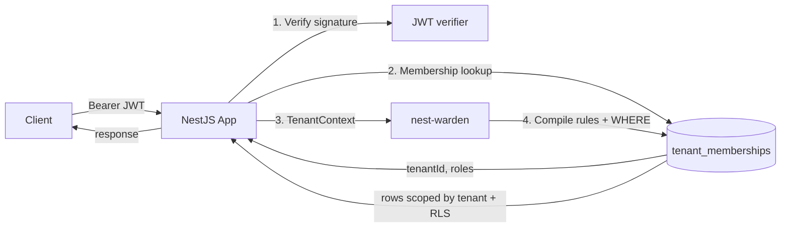

nest-warden enforces what it can structurally — auto-injected tenant
predicate, validation at `.build()` time, parameterized SQL, RLS as
defense in depth — but the contract between the library and the
consumer has hard edges that the library cannot police on your
behalf. This page collects the practices that turn a working
integration into a production-safe one.

## The trust boundary

Authentication and authorization are different layers. nest-warden
covers authorization and trusts whoever populates the
`TenantContext` to have done authentication correctly first. The
library's only job at the trust boundary is to make sure that
once `TenantContext` is set, every read and write respects it.



The single most important property: **the resolved
`TenantContext.tenantId` and `TenantContext.roles` come from a
server-side lookup, never from a client-supplied claim.** A JWT
can carry a `tenantId` claim, but it must be treated as a *request*
from the client, not as truth. Authoritative data lives in the
database.

## Authentication: implementing `resolveTenantContext`

The library's `TenantAbilityModule.forRoot({ resolveTenantContext })`
is the trust boundary. Get it right and the rest of the library
inherits the guarantee.

### The wrong shape

```ts
// WRONG — trusts client-supplied claims
TenantAbilityModule.forRoot({
  resolveTenantContext: (req) => ({
    tenantId: req.user.tenantId,    // ← from JWT, attacker-controlled
    subjectId: req.user.sub,
    roles: req.user.roles,           // ← also from JWT
  }),
});
```

A signed JWT proves only that *the auth provider* asserted those
claims. It does not prove the user is *currently* a member of the
claimed tenant or that their roles haven't been revoked since the
token was issued. Long-lived tokens make this gap larger.

### The right shape

```ts
TenantAbilityModule.forRoot({
  resolveTenantContext: async (req) => {
    const user = req.user;            // populated by your JWT guard
    const claimedTenant =
      req.params.tenantId ?? req.headers['x-tenant-id'];

    const membership = await this.memberships.findOne({
      where: {
        userId: user.sub,             // sub IS verified by signature
        tenantId: claimedTenant,
        active: true,
      },
    });
    if (!membership) {
      throw new ForbiddenException('No active membership in tenant.');
    }

    return {
      tenantId: membership.tenantId,  // from DB
      subjectId: user.sub,
      roles: membership.roles,        // from DB
    };
  },
});
```

The `sub` claim is verified — the JWT's signature guarantees the
auth provider issued the token for that subject. Everything else
(`tenantId`, `roles`, group memberships) gets re-derived from the
database on every request.

## Required practices

### 1. Use asymmetric JWT signing in production

Sign tokens with RS256 / ES256 and verify against the auth
provider's published JWKS endpoint. Never share an HS256 secret
between issuer and verifier in a multi-service system — anyone
who can verify can also forge.

### 2. Set short JWT lifetimes; refresh from the server

The window between role revocation and JWT expiry is the window
where a revoked user keeps their old permissions. Keep access
tokens short (5–15 minutes) and require refresh against your auth
provider, which checks live state on every refresh.

### 3. Enable Postgres RLS as defense in depth

Every nest-warden integration with Postgres should enable RLS on
every tenant-scoped table. Your migration creates the policy; one
of three strategies sets the per-request session variable. See the
[RLS guide](/docs/integration/rls-postgres/) for policy authoring,
and the
[Auto-setting the RLS session variable recipe](/docs/advanced/recipes/#auto-setting-the-rls-session-variable)
for the wiring options (the shipped `RlsTransactionInterceptor` is
the simplest; a TypeORM-subscriber or scoped-transaction approach
fits high-RPS workloads better).

The reason: RLS catches the cases the library can't. A teammate who
loads `dataSource.getRepository(Merchant)` instead of going through
`TenantAwareRepository` bypasses the auto-injected tenant predicate
— but RLS still refuses cross-tenant rows at the database layer.

### 4. Treat `crossTenant` rules as audited code

Every `builder.crossTenant.can(...)` call is an explicit declaration
that this rule may read across tenants. Code review should treat
those call sites with extra scrutiny. The library marks the rules
so you can assert in audit logs or dashboards "this decision was a
cross-tenant grant."

### 5. Never bypass `validateRules` in production

The `builder.validateRules: false` escape hatch exists for
library-internal tests. Setting it false in production removes the
structural guarantee that every rule has either a tenant predicate
or an explicit `crossTenant` marker. There is no legitimate reason
to do this in a deployed app.

### 6. Server-side validation of every membership request

When a user requests access to tenant `X`, do not derive `X` from
the JWT. Take it from the URL or an explicit header, then look it
up in the membership table to confirm the user actually belongs
there. The library cannot do this for you because the membership
schema is consumer-owned.

## Recommended practices

### Use `applyRoles` over inline `if (ctx.roles.includes(...))` for value-condition rules

The role registry pattern (RFC 001 Phase B) gives you:

- A single source of truth for what permissions exist.
- Compile-time checking that role definitions reference real
  permissions.
- An attribution `reason` field on every rule for audit logging.
- A natural place to plug tenant-managed custom roles in Phase C.

Inline `builder.can(...)` calls are still appropriate for rules
with `$relatedTo` or other shapes that don't fit the registry's
declarative form. The two styles coexist cleanly.

### Pair forward and reverse checks for the same action

```ts
// Reverse: which merchants can the user approve?
const approvable = await accessibleBy(ability, 'approve', 'Merchant', { ... });

// Forward: can the user approve THIS specific merchant?
if (!ability.can('approve', merchant)) {
  throw new ForbiddenException();
}
```

The forward check inside the service is required for rules with
row-level conditions; the policy guard alone sees only
`(action, subject)` and can't bind conditions to a concrete row.
See [Updates and deletes](/docs/integration/typeorm/#updates-and-deletes).

### Log authorization decisions

Every rule emitted by `applyRoles` carries a `reason` field with
the JSON `{ role, permission }`. When the decision-logging
extension lands ([Theme 5](/docs/roadmap/things-to-do/#5-authorization-decision-logging)),
this field becomes the attribution key. Until then, rolling your
own logger that reads `rule.reason` for `applyRoles`-emitted rules
is straightforward.

### Prefer `accessibleBy()` over `loadAll().filter(can(...))`

The N+1 pattern is wrong on multiple axes — performance, but also
correctness. `loadAll` runs without the tenant predicate the rule
defines, so a buggy rule that doesn't filter properly leaks rows
through the `loadAll` step before the in-memory filter even runs.
`accessibleBy` is the only way to guarantee the database refuses
unauthorized rows.

## Anti-patterns

| Anti-pattern | Why it's dangerous |
|---|---|
| Trusting `req.user.tenantId` from JWT | JWT carries a claim, not a fact. Membership state changes between issue and use |
| Calling `repo.find({ where: { tenantId: ctx.tenantId } })` | Easy to forget the WHERE on the next call site. Use `TenantAwareRepository` or `accessibleBy()` |
| Disabling RLS to "speed up dev" | Tests that pass without RLS won't catch the bypass case in prod when RLS is on |
| Sharing a single `TenantAbilityFactory` across tenants | The factory is REQUEST-scoped on purpose. Sharing it leaks rules across tenants |
| Caching abilities across requests | Roles change. A cached ability is stale; the next request might be unauthorized |
| Mutating registry objects (`permissions[name].conditions.foo = ...`) | The registry is read-only by contract. The library clones at the call site, but your callers might not |
| Returning entity objects directly when a role has field-level restrictions | The library doesn't auto-mask responses. See [field-level restrictions](/docs/core-concepts/conditional-authorization/#field-level-restrictions) |

## Threat-model checklist

Run through this list before declaring a feature production-ready:

- [ ] Every `defineAbilities` rule is either auto-injected with the
  tenant predicate (`builder.can`) or explicitly cross-tenant
  (`builder.crossTenant.can`). `builder.validateRules` enforces this.
- [ ] `resolveTenantContext` does a server-side membership lookup;
  no fields come unverified from the JWT.
- [ ] Postgres RLS is enabled on every tenant-scoped table.
- [ ] One of the three RLS session-variable strategies is wired (see the
  [recipe](/docs/advanced/recipes/#auto-setting-the-rls-session-variable)).
- [ ] Every controller route reaches a tenant-scoped repository
  (or `accessibleBy`); raw `dataSource.getRepository(...)` calls
  are confined to admin / migration code paths.
- [ ] Field-level rules project the response explicitly via
  `permittedFieldsOf` — see the example app's
  `findOneProjected`.
- [ ] Update and delete code paths follow the
  load-then-check-then-persist pattern. The forward check
  (`ability.can(action, instance)`) runs against the loaded row.
- [ ] Cross-tenant rules are deliberate, audited, and produce
  audit-log entries the security team can review.
- [ ] No `validateRulesAtBuild: false` in production code.
- [ ] JWTs sign asymmetrically; lifetimes are short.
- [ ] CI runs `pnpm test:coverage` (not `pnpm test`) so the 100%
  coverage gate is enforced.

## See also

- [Tenant Context](/docs/core-concepts/tenant-context/) — what `resolveTenantContext` returns.
- [Cross-tenant Opt-out](/docs/core-concepts/cross-tenant/) — when bypassing the tenant predicate is appropriate.
- [Postgres RLS](/docs/integration/rls-postgres/) — defense in depth at the DB layer.
- [Roadmap → Things to do](/docs/roadmap/things-to-do/) — Theme 7 covers the security-hardening test plan we want to ship next.
