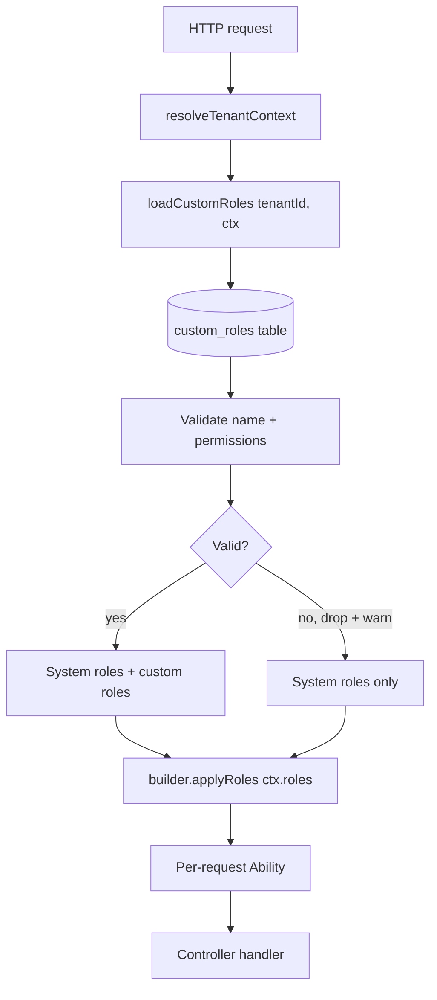

`TenantAbilityBuilder` is the centerpiece of nest-warden — it extends
CASL's `AbilityBuilder` with **automatic tenant-predicate injection** on
every rule.

## The behavior

Without nest-warden:

```ts
// Stock CASL — manual tenant scoping (footgun-prone)
const builder = new AbilityBuilder<AppAbility>(createMongoAbility);
builder.can('read', 'Merchant', { tenantId: ctx.tenantId, status: 'active' });
//                                ^^^^^^^^^^^^^^^^^^^^^^^^
//                                forget once → cross-tenant leak
builder.can('update', 'Merchant', { tenantId: ctx.tenantId, agentId: ctx.subjectId });
//                                  ^^^^^^^^^^^^^^^^^^^^^^^^
//                                  repeated on every rule
```

With nest-warden:

```ts
// nest-warden — auto-scoped by construction
const builder = new TenantAbilityBuilder<AppAbility>(createMongoAbility, ctx);
builder.can('read', 'Merchant', { status: 'active' });
//   ↑ tenantId injected from `ctx` at this exact call
builder.can('update', 'Merchant', { agentId: ctx.subjectId });
//   ↑ also auto-scoped, no repetition
```

After `builder.build()`, both rules carry the tenant predicate exactly
as if you'd written it manually. The runtime behavior is identical to
stock CASL — the only difference is who wrote the predicate.

## How it works

`TenantAbilityBuilder` overrides `can()` and `cannot()` to call CASL's
internal `_addRule`, then post-process the just-pushed rule to merge in
the tenant predicate. The base CASL plumbing is intact; we only bolt
on a one-line mutation per rule.

At `.build()`, `validateTenantRules` walks every rule and asserts each
either:

1. Has the `tenantField` key in its conditions, or
2. Is marked with the cross-tenant opt-out (created via
   `builder.crossTenant.*`).

A violation throws `CrossTenantViolationError` immediately — no rule
makes it into a built ability without one of those two markers.

## Custom tenant field

If your app uses a different column name (e.g., `orgId`):

```ts
const builder = new TenantAbilityBuilder<AppAbility>(
  createMongoAbility,
  ctx,
  { tenantField: 'orgId' },
);
```

The injection and validation now use `orgId`. This must match the
`@TenantColumn()` you've placed on your TypeORM entities and the
`tenantField` option on `TenantAbilityModule.forRoot()`.

## Numeric tenant IDs

Pass `number` as the second generic:

```ts
const builder = new TenantAbilityBuilder<AppAbility, number>(
  createMongoAbility,
  { tenantId: 42, subjectId: 1, roles: ['agent'] },
);
builder.can('read', 'Merchant');
// → conditions: { tenantId: 42 }
```

## Disabling the validator (escape hatch)

For library-internal tests of the bypass path:

```ts
const builder = new TenantAbilityBuilder<AppAbility>(
  createMongoAbility,
  ctx,
  { validateRules: false },
);
```

This is intentionally undocumented in the README. **Don't use this
in production code** — it removes the structural guarantee. If you
have a legitimate cross-tenant rule, use `builder.crossTenant.can(...)`
instead; the validator accepts it.

## Builder API at a glance

```ts
class TenantAbilityBuilder<TAbility, TId extends TenantIdValue = string>
  extends AbilityBuilder<TAbility>
{
  // Auto tenant-scoped (default usage)
  can: (action, subject, conditions?, fields?) => RuleBuilder;
  cannot: (action, subject, conditions?, fields?) => RuleBuilder;

  // Cross-tenant opt-out (no injection, marked for audit)
  crossTenant: {
    can: AbilityBuilder['can'];
    cannot: AbilityBuilder['cannot'];
  };

  // Expand named roles from the registry into rules (RFC 001 Phase B)
  applyRoles(roleNames: readonly string[]): void;

  // Build with validation (throws on missing tenant predicate)
  build(options?: AbilityOptions): TAbility;

  // Read-only accessors
  get tenantField(): string;
  get tenantContext(): TenantContext<TId>;
}
```

## Role-based expansion: `applyRoles`

For applications that want to manage permissions through named
roles (rather than hand-rolled `if (ctx.roles.includes(...))`
branches), the builder exposes `applyRoles(roleNames)`. The method
expands a list of role names into rules using the permission and
role registries provided in the builder options.

```ts
import { definePermissions, defineRoles } from 'nest-warden';

const permissions = definePermissions<AppAction, AppSubject>({
  'merchants:read':            { action: 'read',    subject: 'Merchant' },
  'merchants:approve-pending': {
    action: 'approve',
    subject: 'Merchant',
    conditions: { status: 'pending' },
  },
});

const systemRoles = defineRoles<keyof typeof permissions>({
  admin:    { permissions: ['merchants:read', 'merchants:approve-pending'] },
  reviewer: { permissions: ['merchants:approve-pending'] },
});

// Inside defineAbilities:
const builder = new TenantAbilityBuilder(createMongoAbility, ctx, {
  permissions,
  systemRoles,
});
builder.applyRoles(ctx.roles);          // expand named roles to rules
builder.can('manage', 'AuditLog');      // ad-hoc rules still work
const ability = builder.build();
```

Behavior contracts (per RFC 001):

- **Unknown role names are silently dropped.** Adding a new role
  to the registry doesn't require coordinating JWTs across all
  live sessions; rolling back a role removal doesn't break old
  tokens that still mention the removed name.
- **Unknown permission references throw `UnknownPermissionError`.**
  Unlike unknown role names, an unknown *permission* is a
  programming error in the registry itself — not a runtime
  state mismatch. Surface it loudly.
- **Conditions are cloned** before being handed to CASL, so the
  per-request mutation that injects the tenant predicate doesn't
  pollute the registry's source-of-truth across requests or
  tenants.
- **Every emitted rule carries a `reason`** field with the JSON
  string `{ "role": <name>, "permission": <name> }`. A future
  decision logger can attribute decisions back to the originating
  role-permission pair without re-engineering — no change to
  `applyRoles` will be needed when that lands.
- **Coexists with ad-hoc rules.** `applyRoles` is additive. Any
  combination of `applyRoles`, `builder.can`, and
  `builder.crossTenant.can` calls in the same `defineAbilities`
  callback compose normally.

For the full design rationale and the open questions that were
resolved before this landed, see
[RFC 001](/docs/roadmap/rfcs/001-roles/).

### Tenant-managed custom roles (Phase C)

System roles cover the engineering team's needs. Most multi-tenant
SaaS apps also need **tenant admins** to compose roles through a
UI without redeploying the application. Configure a
`loadCustomRoles` callback on `TenantAbilityModule.forRootAsync`
and the library expands those roles the same way it expands system
roles:

```ts
TenantAbilityModule.forRootAsync<AppAbility>({
  imports: [TypeOrmModule.forFeature([CustomRole])],
  inject: [getRepositoryToken(CustomRole)],
  useFactory: (customRolesRepo: Repository<CustomRole>) => ({
    permissions,
    systemRoles,
    resolveTenantContext: ...,
    defineAbilities: (builder, ctx) => builder.applyRoles(ctx.roles),
    loadCustomRoles: async (tenantId) => {
      const rows = await customRolesRepo.find({ where: { tenantId } });
      return rows.map((r) => ({
        name: r.name,
        permissions: r.permissions, // string[]
        description: r.description ?? undefined,
      }));
    },
  }),
})
```



Validation is fail-closed by design:

- **Name collision with a system role** → custom role is dropped,
  system role wins, library logs `console.warn`. RFC § Q4.
- **Permission reference not in the registry** → custom role is
  dropped, library logs `console.warn`. The other roles for the
  same request still apply.

The motivation: a misconfigured row in the tenant's
`custom_roles` table should not error out every request from
that tenant. Surface the misconfiguration via logs and let the
request continue with the surviving roles.

The library memoizes the loader per request — calling
`applyRoles` multiple times in the same `defineAbilities` does
not re-fire the database query. Cross-request caching (Redis
etc.) is the consumer's responsibility, the same way it is for
JWT verification keys and DB connections.

## See also

- [Tenant Context](/docs/core-concepts/tenant-context/) — what feeds the builder.
- [Cross-tenant Opt-out](/docs/core-concepts/cross-tenant/) — when to bypass injection.
- [Conditional Authorization](/docs/core-concepts/conditional-authorization/) — Mongo operators that compose with the tenant predicate.
