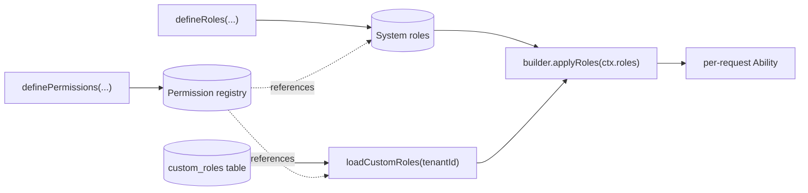

This page is a tutorial for the role/permission registry pattern
introduced by [RFC 001](/docs/roadmap/rfcs/001-roles/). It walks
through every step of wiring named roles into a NestJS application:
defining permissions, declaring system roles, expanding them inside
`defineAbilities`, loading tenant-managed custom roles from a
database, and migrating an existing `if (ctx.roles.includes(...))`
codebase.

If you're new to the library, read
[Tenant-aware Builder](/docs/core-concepts/tenant-builder/) first —
the registry pattern composes with the builder, it doesn't replace
it.

## Why named roles

Authoring rules inline works fine for engineering teams who can
edit TypeScript:

```ts
defineAbilities: (builder, ctx) => {
  if (ctx.roles.includes('admin')) {
    builder.can('manage', 'Merchant');
    builder.can('manage', 'Payment');
  }
  if (ctx.roles.includes('developer')) {
    builder.can('read', 'Merchant');
    builder.can('read', 'Payment');
  }
}
```

It does not work when a non-technical tenant admin needs to compose
a "QA Reviewer" role through a UI without redeploying. The registry
pattern decouples the **definition** of permissions (still in code)
from the **assembly** of roles (which can come from code, the
database, or both).



## Step 1 — Define permissions

A **permission** is a named tuple of `(action, subject, conditions?,
fields?, crossTenant?)`. The name is the stable identifier you
reference everywhere (audit logs, role tables, UIs); the tuple is
the underlying CASL rule shape.

Permissions are defined once at module init via `definePermissions`.
The function returns its input unchanged at runtime — the value is
in the typing: the `const` type modifier preserves literal-typed
keys so you can derive a `Permission` string-literal union via
`keyof typeof`.

```ts
import { definePermissions } from 'nest-warden';

export type AppAction = 'read' | 'create' | 'update' | 'delete' | 'manage' | 'approve';
export type AppSubject = 'Merchant' | 'Payment' | 'Agent';

export const permissions = definePermissions<AppAction, AppSubject>({
  // Plain (action, subject) pair — anyone holding this permission
  // can read any merchant in their tenant.
  'merchants:read': {
    action: 'read',
    subject: 'Merchant',
  },

  // Permission with a condition — only matches pending merchants.
  // The condition compiles to SQL via accessibleBy() AND runs
  // against loaded entities for forward checks.
  'merchants:approve-pending': {
    action: 'approve',
    subject: 'Merchant',
    conditions: { status: 'pending' },
  },

  // Permission with field-level restrictions.
  // permittedFieldsOf(ability, 'read', 'Merchant') returns
  // ['id', 'name', 'status'] — the controller projects manually.
  'merchants:read-public': {
    action: 'read',
    subject: 'Merchant',
    fields: ['id', 'name', 'status'],
  },

  // Cross-tenant permission for support staff. Opts out of the
  // auto-injected tenant predicate. Use sparingly and audit the
  // call sites.
  'platform:read-merchants': {
    action: 'read',
    subject: 'Merchant',
    crossTenant: true,
  },
});

export type Permission = keyof typeof permissions;
```


The `<resource>:<verb>[-<modifier>]` convention reads naturally and
is unambiguously parseable. RFC 001 § Q1 reserves the `:` separator
within names — pick a different character if you need it inside a
subject or action.


## Step 2 — Define system roles

A **system role** is a named bundle of permissions, defined once
in code and stable across all tenants. Use it for the engineering-
defined roles like `admin`, `developer`, `viewer`.

```ts
import { defineRoles } from 'nest-warden';

export const systemRoles = defineRoles<Permission>({
  admin: {
    description: 'Full tenant administration',
    permissions: [
      'merchants:read',
      'merchants:approve-pending',
    ],
  },
  developer: {
    description: 'Engineering staff with read access',
    permissions: ['merchants:read'],
  },
  viewer: {
    description: 'Read-only public listings',
    permissions: ['merchants:read-public'],
  },
  platformStaff: {
    description: 'Cross-tenant read access for support',
    permissions: ['platform:read-merchants'],
  },
});
```

The `<TPermission>` parameter narrows to your registry's key union,
so referencing an undefined permission name fails at compile time:

```ts
defineRoles<Permission>({
  admin: {
    permissions: ['merchants:typo'], // ← TS error: '"merchants:typo"' is not assignable
  },
});
```

## Step 3 — Expand roles in `defineAbilities`

Pass `permissions` and `systemRoles` to `TenantAbilityModule.forRoot`
(or `forRootAsync`), then call `builder.applyRoles(ctx.roles)` in
your `defineAbilities` callback:

```ts
@Module({
  imports: [
    TenantAbilityModule.forRoot<AppAbility>({
      resolveTenantContext: async (req) => { /* ... */ },
      defineAbilities: (builder, ctx) => {
        // Expand named roles into rules
        builder.applyRoles(ctx.roles);

        // Plus any inline rules that don't fit the registry
        // (typically $relatedTo with closures over ctx)
        if (ctx.roles.includes('agent')) {
          builder.can('read', 'Merchant', {
            $relatedTo: {
              path: ['agents_of_merchant'],
              where: { id: ctx.subjectId },
            },
          } as never);
        }
      },
      // Permissions are top-level — the foundational vocabulary
      // that roles and any future composer reference.
      permissions,
      // Role-specific configuration grouped under `roles`.
      roles: { systemRoles },
    }),
  ],
})
export class AppModule {}
```

`applyRoles` walks `ctx.roles`, resolves each name against
`systemRoles` (and against custom roles loaded from
`loadCustomRoles`, see step 4), and emits one `can()` (or
`crossTenant.can()` for cross-tenant permissions) per permission.
Every emitted rule carries a `reason` field with
`{ role, permission }` JSON for future audit-log attribution.

**Unknown role names are silently dropped.** Adding a new role to
the registry doesn't require coordinating JWTs across all live
sessions; rolling back a role removal doesn't break old tokens
that still mention the removed name.

## Step 4 — Load tenant-managed custom roles

Tenant admins typically need to create roles through a UI without
deploying code. The `loadCustomRoles` callback runs once per
request and returns custom roles for the active tenant:

```ts
TenantAbilityModule.forRootAsync<AppAbility>({
  imports: [TypeOrmModule.forFeature([CustomRole])],
  inject: [getRepositoryToken(CustomRole)],
  useFactory: (customRolesRepo: Repository<CustomRole>) => ({
    resolveTenantContext: async (req) => { /* ... */ },
    defineAbilities: (builder, ctx) => builder.applyRoles(ctx.roles),
    permissions,
    roles: {
      systemRoles,
      loadCustomRoles: async (tenantId) => {
        const rows = await customRolesRepo.find({ where: { tenantId } });
        return rows.map((r) => ({
          name: r.name,
          permissions: r.permissions,
          description: r.description ?? undefined,
        }));
      },
    },
  }),
})
```

Behavior contracts:

- **Per-request memoization.** Multiple `applyRoles` calls in the
  same request don't re-fire the loader. RFC § Q5.
- **Fail-closed validation.** A custom role whose `name` collides
  with a system role is dropped (system role wins). A custom role
  referencing an unknown permission is dropped. Both warn through
  the configured `roles.logger` (defaults to NestJS `Logger`) so the
  misconfiguration is visible without erroring out the whole request.
  Set `roles.silentDropouts: true` to suppress the log calls.
- **Cross-request caching is your problem.** Wrap the loader with
  Redis or whatever fits your latency budget — the library treats
  authoritative data as living in your DB and doesn't try to be a
  cache.

## Step 5 — Custom-role data model (sample)

The library is storage-agnostic. The example app ships this shape:

```sql
CREATE TABLE custom_roles (
  id          uuid        PRIMARY KEY DEFAULT gen_random_uuid(),
  tenant_id   uuid        NOT NULL REFERENCES tenants(id),
  name        text        NOT NULL,
  description text,
  permissions jsonb       NOT NULL DEFAULT '[]'::jsonb,
  created_at  timestamptz NOT NULL DEFAULT now(),
  UNIQUE (tenant_id, name)
);
```

Storing permission **names** (not rule shapes) keeps the table
schema stable as the application's rules evolve. The registry
resolves names to rule tuples on the library side.


The `loadCustomRoles` callback runs BEFORE the per-request RLS
session variable is set — it has to, because the tenant context
is what determines which roles to load. Defense in depth here is
the explicit `WHERE tenant_id = $1` in the consumer's query. RLS
on the role-loading path produces a chicken-and-egg problem
without adding security beyond what the explicit filter
provides.


## Migration: from raw rules to the registry

If you have an existing codebase with `if (ctx.roles.includes(...))`
branches, migrate one role at a time. Both styles can coexist in
the same `defineAbilities` callback — `applyRoles` is purely
additive.

### Before

```ts
defineAbilities: (builder, ctx) => {
  if (ctx.roles.includes('admin')) {
    builder.can('manage', 'Merchant');
    builder.can('manage', 'Payment');
    builder.can('manage', 'Agent');
  }
  if (ctx.roles.includes('viewer')) {
    builder.can('read', 'Merchant', ['id', 'name', 'status']);
  }
  if (ctx.roles.includes('platformStaff')) {
    builder.crossTenant.can('read', 'Merchant');
  }
}
```

### After

`permission-registry.ts`:

```ts
export const permissions = definePermissions<AppAction, AppSubject>({
  'merchants:manage':       { action: 'manage', subject: 'Merchant' },
  'payments:manage':        { action: 'manage', subject: 'Payment' },
  'agents:manage':          { action: 'manage', subject: 'Agent' },
  'merchants:read-public':  { action: 'read', subject: 'Merchant', fields: ['id', 'name', 'status'] },
  'platform:read-merchants':{ action: 'read', subject: 'Merchant', crossTenant: true },
});

export const systemRoles = defineRoles<keyof typeof permissions>({
  admin:         { permissions: ['merchants:manage', 'payments:manage', 'agents:manage'] },
  viewer:        { permissions: ['merchants:read-public'] },
  platformStaff: { permissions: ['platform:read-merchants'] },
});
```

`app.module.ts`:

```ts
TenantAbilityModule.forRoot<AppAbility>({
  permissions,
  systemRoles,
  resolveTenantContext: ...,
  defineAbilities: (builder, ctx) => builder.applyRoles(ctx.roles),
});
```

The behavior is identical — the registry emits the same rule shapes
the inline code did, including the cross-tenant marker on
`platformStaff` (the `crossTenant: true` flag in the permission
routes the call through `builder.crossTenant.can` automatically).

### Roles that should stay inline

Some rule shapes don't fit the registry cleanly. Keep them inline
without forcing a fit:

| Pattern | Why it doesn't fit |
|---|---|
| `$relatedTo` referencing `ctx.subjectId` or other per-request values | The registry stores static shapes. Closures over per-request data don't serialize |
| `cannot()` rules | `PermissionDef` is positive-only by RFC 001 design (Q2) |
| Rules that branch on request URL, headers, or other ad-hoc context | Not a role concept; raw `builder.can()` is the right tool |

The example app keeps `agent` and `cautious-approver` inline for
exactly these reasons. See
[`examples/nestjs-app/src/auth/permissions.ts`](https://github.com/luzan/nest-warden/blob/main/examples/nestjs-app/src/auth/permissions.ts).

## API reference

### `definePermissions<TAction, TSubject>(map)`

Returns the input map unchanged. The value is in the typing —
preserves literal-typed keys so consumers derive a `Permission`
string-literal union via `keyof typeof`.

### `defineRoles<TPermission>(map)`

Same shape for system roles. The `<TPermission>` parameter narrows
to the registry's key union; unknown permission names fail at
compile time.

### `builder.applyRoles(roleNames)`

Expands a list of role names into rules. Looks up each name in
`systemRoles` first, then in `customRoles` (per-request, populated
by the factory from `loadCustomRoles`). Unknown names are silently
dropped. Throws `UnknownPermissionError` if any matched role
references a permission that's not in the registry.

### `loadCustomRoles(tenantId, ctx)`

Module option. Called once per request. Returns
`CustomRoleEntry[]` (or a Promise resolving to one). The library
validates each entry, drops misconfigured ones with a warning, and
threads the survivors into the per-request builder.

### `CustomRoleEntry`

```ts
interface CustomRoleEntry<TPermission extends string = string> {
  readonly name: string;
  readonly permissions: readonly TPermission[];
  readonly description?: string;
}
```

### `UnknownPermissionError`, `SystemRoleCollisionError`

Both extend `NestWardenError` (which extends `Error`; renamed from
`MultiTenantCaslError` in 0.3.0-alpha — the old name is still
exported as a `@deprecated` alias for one cycle). Carry
diagnostic fields for the offending role + permission name. See
the [errors module](https://github.com/luzan/nest-warden/blob/main/src/core/errors.ts)
for the full surface.

## See also

- [RFC 001](/docs/roadmap/rfcs/001-roles/) — the design rationale and the open questions resolved before this shipped.
- [Tenant-aware Builder](/docs/core-concepts/tenant-builder/) — the lower-level API that `applyRoles` extends.
- [Conditional Authorization](/docs/core-concepts/conditional-authorization/) — operators that compose with permission conditions.
- [Security Best Practices](/docs/advanced/security-best-practices/) — production-hardening checklist that includes role-handling guidance.
